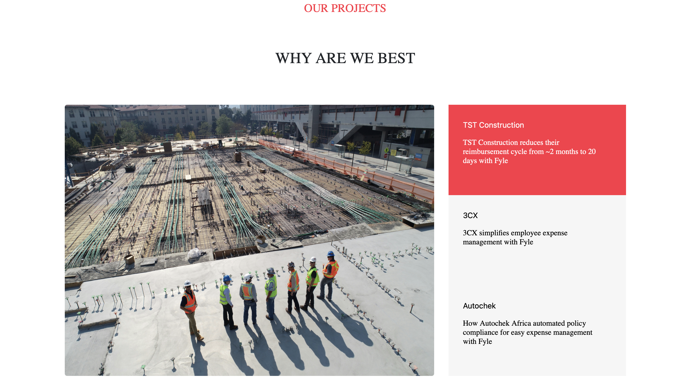

# Digital Marketing Website

## UI Designs

**Adobe XD link -** [UI Designs](https://xd.adobe.com/view/62beadb2-fac2-491b-90d9-5bc90d77ae70-37ed/)

## User Interactions

### Animations and Functionalities

1. **'Contact Us' Button**

   - The '**Contact Us**' button

2. **Pop-up Form and Submission**
   - The pop-up form is designed .
   - Upon submission, the form details are submitted to getform.io.

### Form Submission

1. Create a free account on [getform.io](http://getform.io/).
2. Create an endpoint and POST your form data to this endpoint.

   - This endpoint will act as an API endpoint to receive form submissions.

3. **'What We Do' Section**

   - This section features a slider with images sliding from left to right.
   - The 3 dots on the bottom right change accordingly.
   - On hovering over any image, the picture is replaced with the design shown in the .
   - The '**Read More**' button opens 'fylehq.com' in a new tab.

4. **'Our Project' Section**
   - The image on the left changes based on the content on the right.
   - Clicking the content on the right changes the image on the left.
   - The other two images can be of your choice.
5. **Highlight on Hover**
   - Hovering over the cards causes a highlighted interaction as shown in the .

### Hosting

The page is hosted on GitHub Pages.

## Built With

- **jQuery**
- **Bootstrap**
- **HTML5**
- **CSS3**

## File Structure

digital-marketing-website/
├── assets/
│ ├── (all artifacts)
├── js/
│ ├── jq.min.js
│ ├── scripts.js
├── screenshots/
│ ├── (all screenshots)
├── index.html
├── index.css
├── index.js
├── README.md

## Contributing

1. Fork the repository.
2. Create your feature branch (`git checkout -b feature/AmazingFeature`).
3. Commit your changes (`git commit -m 'Add some AmazingFeature'`).
4. Push to the branch (`git push origin feature/AmazingFeature`).
5. Open a pull request.
